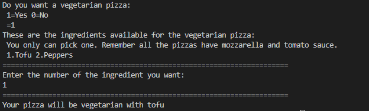

<div align = "center">
<h1>

# **Unit 2**
 <div align = "justify">

># **Index:** 
>## [Exercise 1](#1-renta)  
>## [Exercise 2](#2-benefits)  
>## [Exercise 3](#3-tickets)  
>## [Exercise 4](#4-pizzeria)  
>## [Exercise 5](#5-temperature)  
>## [Exercise 6](#6-bill)  
>## [Exercise 7](#7-bindec)    
>## [Exercise 8](#8-multiplication-tables)    
>## [Exercise 9](#9-bisection-method)    

</h3>
<div align = "justify">
 
># **1. Rent:**
>## **What does it request?** 
>### A program that asks the user for his annual rent and displays the corresponding tax rate
>## **Input.**
```c++
    // Data entry
    cout << "Introduce el costo de tu renta: " << endl;
    cin >> renta;
```
>## **Process.**
```c++
    // Data processing
    if (renta < 10000)
    {
        porcentaje = 5;
    }
    else if (renta >= 10000 && renta < 20000)
    {
        porcentaje = 15;
    }
    else if (renta >= 20000 && renta < 35000)
    {
        porcentaje = 20;
    }
    else if (renta >= 35000 && renta < 60000)
    {
        porcentaje = 30;
    }
    else if (renta >= 60000)
    {
        porcentaje = 45;
    }
    else
    {
        cout << "ERROR: la renta introducida es incorrecta" << endl;
    }
    impuestoAPAgar = renta * porcentaje / 100;

```
>## **Output.**
```c++
    //Data output
    cout << "El porcentaje impuesto es de: " << porcentaje << "%" << endl;
    cout << "El impuesto a pagar es de: $" << impuestoAPAgar << endl;
```
>## **Explanation.**
>### 1. Ask the user for his annual rent.
>### 2. With the information we can start with our comparison process
>### 2.1 If the user does not enter a valid rent, print a message that the user entered an incorrect number.  
>### 2.2 If the user entered a valid rent, continue with the program.
>### 3.  Check by several if's which tax rate.  
>### 3.1 If the rent is less than $10, 000 it is 5% (.05).  
>### 3.2 If the rent is greater than or equal to $10,000 and less than $20,000 it is 15% (.15).  
>### 3.3 If the rent is greater or equal to $20,000 and less than $35,000, it is 20% (.20).   
>### 3.4 If the rent is greater or equal to $35,000 and less than $60,000 it is 30% (.30).  
>### 3.5 If the rent is greater than $60,000 it is 45% (.45). 
>### 4. Multiply the rent by the tax rate.
>### 5. Print the tax rate and its equivalent in dollars. 
>## **Tests.**
>### A) Rent < $10,000
> 
> 
>### B) Rent >= $10,000 and Rent < $20,000
> 
>  
>### C) Rent >= $20,000 and Rent < $35,000 
> 
> 
>### D) Rent >= $35,000 and Rent < $60,000
> 
> 
>### F) Rent >= $60,000
> 


># **2. Benefits:**
>## **What does it request?** 
>### A program that asks the user for his score and displays the corresponding typo of benefit and money
>## **Input.**
```c++
    // Data entry
    cout<<"Enter your rating: "<<endl;
    cin>>calificacion;
```
>## **Process.**
```c++
    // Code Process
    if (calificacion==0.0||calificacion==0.4||calificacion>=0.6&&calificacion<=1){
        beneficios= 2400*calificacion;
        // Data output
        cout<<"Your rate is: "<<calificacion<<endl;
        cout<<"Your benefit will be: $"<<beneficios<<endl;
    }
    else {
        // Data output
        cout<<"Error: Try again, please your rating correctly.  "<<endl;
    }
```
>## **Output.**
```c++
    // Data output
    cout<<"Your rate is: "<<calificacion<<endl;
    cout<<"Your benefit will be: $"<<beneficios<<endl;
    // Data output
    cout<<"Error: Try again, please enter your rating correctly.  "<<endl;
```
>## **Explanation.**
>### 1. Ask the user for his score.
>### 2. Check that the user entered a score greater than or equal to 0.6 or equal to 0.4..
>### 3. If the grade is not between the established ranges, print the else.
>### 4. If it is between the established ranges, multiply the rating by 2400
>### 5. Print the score and the amount of money.
>## **Tests.**
>### A) score >= 0.6
> 
>
>### B) score == 0.4
> 
> 
>### C) score == 0
> 
> 
>### D) Error in score entry
> 


# **3. Tickets:**
>## **What does it request?** 
>###  A program that asks for your age and print the cost of ticked
>## **Input.**
```c++
    // Data entry
    cout << "How is the age of the client? " << endl;
    cin >> edad;
```
>## **Process.**
```c++
    // Data processing
    if (edad < 0)
    {
        cout << "Check the data entered please" << endl;
    }
    else
    {
        if (edad < 4)
        {
            costoEntrada = 0;
        }
        if (edad >= 4 && edad <= 18)
        {
            costoEntrada = 5;
        }
        if (edad > 18)
        {
            costoEntrada = 10;
        }
```
>## **Output.**
```c++
    // Data output
    cout << "The coste of the ticket is= $" << costoEntrada << endl;
```
>## **Explanation.**
>### 1. Ask the user for the client age.
>### 2. Check that the user enters an age within the following range.
>>### 2.1 If the user enters an age lower than 0, a message "Check the data entered please" will be printed.
>>### 2.2 If the user enters a number between 4 and 0, the ticket price is $0.
>>### 2.3 If the user enters an age greater than 4 and less than 18, the ticket price is $5.
>>### 2.4 If the user enters an age greater than 18, the ticket price is $10.
>### 3. Print ticket cost.
>## **Tests.**
>### A) Age < 4 and Age > 0
> 
> 
>### B) Age >= 4 and Age <=18
> 
> 
>### C) Age > 18
> 
> 
>### D) Age < 0
> 
> 

# **4. Pizzeria:**
>## **What does it request?** 
>### Menu of Bella Napoli pizzeria showing your type of pizza and ingredients
>## **Input.**
```c++
    // Data entry
    cout << "Do you want a vegetarian pizza: \n 1=Yes 0=No  \n =";
    cin >> tipoDePizza;
    cout << "Enter the number of the ingredient you want: " << endl;
    cin >> ingredientesVeggie;
    cout << "Enter the number of the ingredient you want: " << endl;
    cin >> ingrdientesNotVeggie;
```
>## **Process.**
```c++
    // Data processing
    if (tipoDePizza == 1)
    {
        cout << "These are the ingredients available for the vegetarian pizza: \n You only can pick one. Remember all the pizzas have mozzarella and tomato sauce. \n 1.Tofu 2.Peppers " << endl;
        cout << "=====================================================================" << endl;
        cout << "Enter the number of the ingredient you want: " << endl;
        cin >> ingredientesVeggie;
        cout << "=====================================================================" << endl;
        if (ingredientesVeggie == 1)
        {
             // Data output
            cout << "Your pizza will be vegetarian with tofu " << endl;
        }
        else if (ingredientesVeggie == 2)
        {
            // Data output
            cout << "Your pizza will be vegetarian with peppers " << endl;
        }
        else
        {
            // Data output
            cout << "Error start over, make sure you enter the data correctly please.";
        }
    }
    else if (tipoDePizza == 0)
    {
        cout << "These are the ingredients available for the not vegetarian pizza: \n You only can pick one. Remember all the pizzas have mozzarella and tomato sauce. \n 1.Peperoni 2.Ham 3.Salmon " << endl;
        cout << "=====================================================================" << endl;
        cout << "Enter the number of the ingredient you want: " << endl;
        cin >> ingrdientesNotVeggie;
        cout << "=====================================================================" << endl;
        if (ingrdientesNotVeggie == 1)
        {
            // Data output
            cout << "Your pizza will not be vegetarian with peperoni " << endl;
        }
        else if (ingrdientesNotVeggie == 2)
        {
            // Data output
            cout << "Your pizza will not be vegetarian with ham " << endl;
        }
        else if (ingrdientesNotVeggie == 3)
        {
            // Data output
            cout << "Your pizza will not be vegetarian with salmon " << endl;
        }
        else
        {
            // Data output
            cout << "Error start over, make sure you enter the data correctly please.";
        }
    }
    else
    {
        cout << "=====================================================================" << endl;
        // Data output
        cout << "Error start over, make sure you enter the data correctly please.";
    }
```
>## **Output.**
```c++
    // Data output
    cout << "Your pizza will be vegetarian with tofu " << endl;
    // Data output
    cout << "Your pizza will be vegetarian with peppers " << endl;
    // Data output
    cout << "Error start over, make sure you enter the data correctly please.";
    // Data output
    cout << "Your pizza will not be vegetarian with peperoni " << endl;
    // Data output
    cout << "Your pizza will not be vegetarian with ham " << endl;
    // Data output
    cout << "Your pizza will not be vegetarian with salmon " << endl;
    // Data output
    cout << "Error start over, make sure you enter the data correctly please.";

```
>## **Explanation.**
>### 1. Ask the user what type of pizza he/she prefers:
>### 1.1 If any number but 1 or 0 is selected it prints "Error start over, make sure you enter the data correctly please.".
>### 1.2 If he selects 1 he enters the vegetarian ingredients menu.
>### 1.3 If he selects 0 he enters the no vegetarian ingredients menu.
>### 2. Display the menu depending on your type of pizza.
>### 2.1 Ask what ingredients you want on your pizza.
>### 3. Depending on the selected ingredient, it prints the ordered pizza


>## **Tests.**
>### A) Type:Vegetarian Ingredient: Tofu
> 
> 
>### B) Type:Vegetarian Ingredient: Pepper
> 
> 
>### C) Type:Vegetarian Ingredient: Pepperoni
> 
> 
>### D) Type:No Vegetarian Ingredient: Ham
> 
> 
>### E) Type:No Vegetarian Ingredient: Salmon
> 
> 
>### F) ERROR
> 

# **5. Temperature:**
>## **What does it request?** 
>### Ask the user 6 temperature and print the mean, highest and lowest temperature.
>## **Input.**
```c++
    // Data entry
    cout << "Give me the temperature: ";
    cin >> temperatura;
```
>## **Process.**
```c++
    do
    {
        // Data entry
        cout << "Give me the temperature: ";
        cin >> temperatura;
        // Data processing
        tempAcum += temperatura;
        contador++;
        if (temperatura >= tempMayor)
        {
            tempMayor = temperatura;
        }
        if (temperatura <= tempMenor)
        {
            tempMenor = temperatura;
        }
    } while (contador < 6);
```
>## **Output.**
```c++
    // Data output
    cout << "The average of temperature is: " << tempAcum / 6 << "°C" << endl;
    cout << "The lower temperature is: " << tempMenor << "°C" << endl;
    cout << "The highest temperature is: " << tempMayor << "°C" << endl;
```
>## **Explanation.**
>### 1. Ask the user 6 temperature.
>### 2. If temparures is higher than the previous one, it save it.
>### 3. If temparures is lower than the previous one, it save it.
>### 4. Print the mean, highest and lower temperature.
>## **Test.**
>### A)
> 
> 

# **6. Bill:**
>## **What does it request?** 
>### Ask the user indefinitely the amount and price of the products, finally print the total price.
>## **Input.**
```c++
    // Data entry
    cout << "How many products were sold: ";
    cin >> cantidadDeProductos;
    cout << "Introduce the price of the product: $";
    cin >> precioDeProducto;
```
>## **Process.**
```c++
    do
    {
        // Data entry
        cout << "How many products were sold: ";
        cin >> cantidadDeProductos;
        // Data processing
        if (cantidadDeProductos != 0)
        {
            cout << "Introduce the price of the product: $";
            cin >> precioDeProducto;
    
        }
        totalFactura += (cantidadDeProductos*precioDeProducto);
    } while (cantidadDeProductos > 0);
```
>## **Output.**
```c++
    // Data output
    cout << "Processing the payment...\n Total cost= $" << totalFactura << endl;
```
>## **Explanation.**
>### Ask the user the amount.
>### Ask the user the price.
>### If the user enter 0 in amount, exit the cycle.
>### Print the total price of all products.
>## **Tests.**
>### A) 
> 
> 

# **7. BinDec:**
>## **What does it request?** 
>### A program to convert decimal to binary
>## **Input.**
```c++
    // Data entry
    cout << "Enter the integrer you want to convert to binary: ";
    cin >> decimal;
```
>## **Process.**
```c++
// Data processing
        if (decimal > 0)
        {
            while (decimal > 0)
            {
                resultado = (decimal % 2 == 0) ? "0" + resultado : "1" + resultado;
                decimal /= 2;
            }
        }
        else if (decimal == 0)
        {
            // Data output
            cout << "Your result is: 0" << endl;
        }
        else
        {
            // Data output
            cout << "ERROR. Please enter an integrer greater than zero " << endl;
        }
    } while (decimal != 0);
```
>## **Output.**
```c++
    // Data output
    cout << "Your result is: 0" << endl;
    // Data output
    cout << "ERROR. Please enter an integrer greater than zero " << endl;
    // Data output
    cout << "Your result is: " << resultado << endl;
```
>## **Explanation.**
>### 1. Ask for the number you want to convert.
>### 2. If the number is 0 print "Your result is: 0".
>### 3. If the number greater than 0.
>### 3.1. Enter a cycle to divide the number by 2 and print the ramainer.
>### 4. If the number less than 0.
>### 4.1. Print the error message and return the user for entry the number again.
>## **Tests.**
>### A) Number < 0
> 
> 
>### B) Number = 0
> 
> 
>### C) Number > 0
> 
> 


# **8. Multiplication tables:**
>## **What does it request?** 
>### A program that prints the table of a desired number with a length entered by the user
>## **Input.**
```c++
    //Data entry
    cout<<"What number do you want to multiply?: ";
    cin>>numTabla;
    cout<<"Up to what number do you want the table?: ";
    cin>>largoTabla;
```
>## **Process.**
```c++
    // Data processing
    for (int contador=1; contador <= largoTabla ; contador++)
    {
        // Data output
        cout<<"|\t"<<contador<<"\t"<<"x"<<"\t"<<numTabla<<"\t"<<"="<<"\t"<<contador*numTabla<<"\t"<<"|"<<endl;
        for (int i = 1; i <= 49; i++)
        {
            cout<<"-";
        }
        cout<<endl;
    }
```
>## **Output.**
```c++
    // Data output
    cout<<"|\t"<<contador<<"\t"<<"x"<<"\t"<<numTabla<<"\t"<<"="<<"\t"<<contador*numTabla<<"\t"<<"|"<<endl;
```
>## **Explanation.**
>### 1. Ask the user for the number.
>### 2. Ask the user for the limit
>### 3. Print the multiplication table up to the limit number entered.
>## **Tests.**
>### A) Number: 2 Limit: 10
> 
> 
>

# **9. Bisection method:**
>## **What does it request?** 
>###
>## **Input.**
```c++

```
>## **Process.**
```c++

```
>## **Output.**
```c++

```
>## **Explanation.**
>###
>## **Tests.**
>###