<h1 align="center">

 <h2 style="color:#7265D0"> TIC TAC TOE 

 
</h1>

 
<h2 align="center">
</h2>

># **INDEX** 
>## [A) Instructions for execution and use](#instruction-for-execution-and-use)
>## [B) Flowchart](#flowchart)
>## [C) Code execution and explanation](#code-execution-and-explanation)
>## [D) Conclusions of the exercise](#conclusions-of-the-excercise)

<h4 align="center">

># **INSTRUCTION FOR EXECUTION AND USE**
</h4>

>## **General considerations:**
>>### 1. In PvP gamemode player 1 will always be X and player 2 will always be O.
>>### 2. In PvPC gamemode player one will be X and PC O.
>>### 3. In PvPC gamemode player always start the game.
>## **Possible ERRORS**

>>### Unfortunately I have to admit that my code is not perfect since it has some small bugs that I have not been able to solve, (although I tried) so I will list the main ones.
>>### If you manage to find any more, let me know through one of my means of contact.

>>### 1. If you enter a character other than a number 

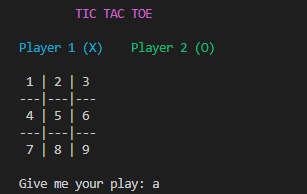 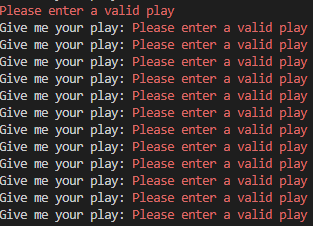

>>### 2. Introducing a non-integer value  

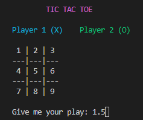 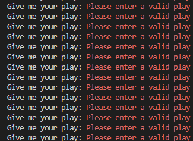

>## **HOW TO USE**
>>### My game is designed to run preferably on Windows so I will explain below how you can test it.
>>### 1. Download the [executable](./TIC-TAC-TOE.exe)
>>### 2. Run the executable
>>### 3. Enjoy.
>>### IF THAT DOESN'T WORK TRY THIS
>>### 1. Install a git console to continue you can install one [here](http://git-scm.com/download/win) and choose the best option for you. 
>>### 2. Make a clone of my repository with this command in your git console:
>>>### git clone https://github.com/UP210553/UP210553_CPP.git
>>### 3. Enter the repository at the direction of the file with the command:
>>>### cd C:\Documents\...
>>### 4. To run the game type the next command:
>>>### 04_Gato.exe
>>### 5. ENJOY

>### [Return to index](#index)

># __FLOWCHART__

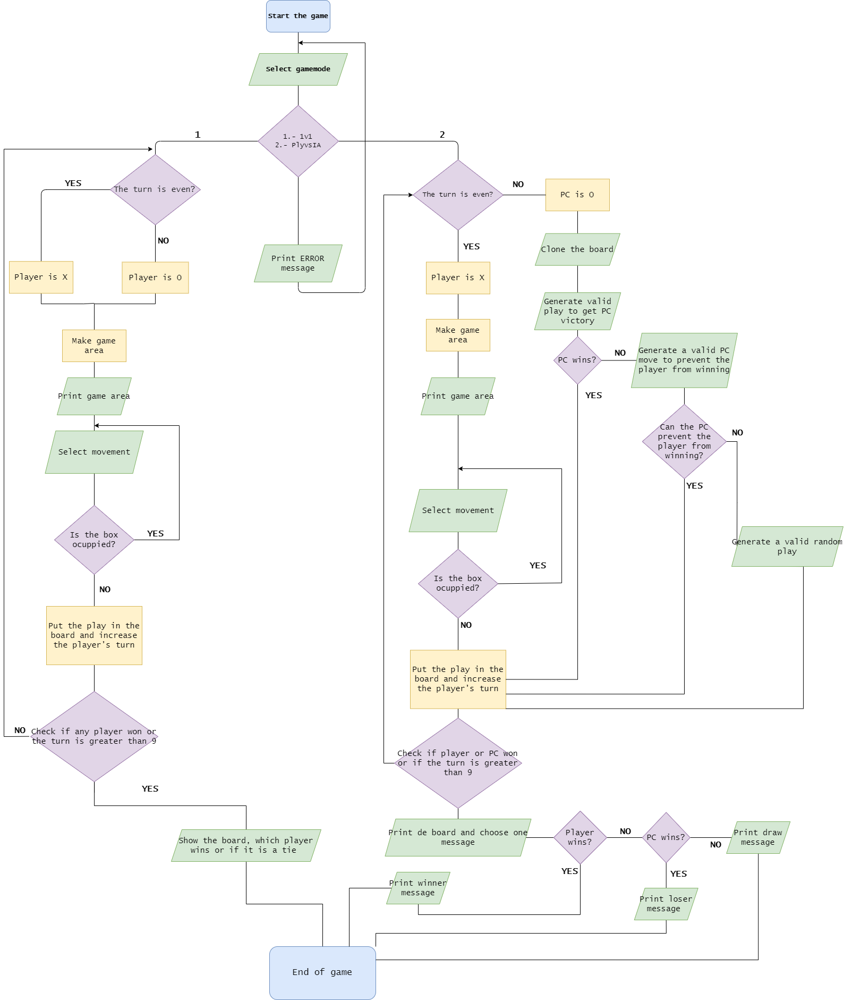

>### [Return to index](#index)

># __CODE EXECUTION AND EXPLANATION__

>## **Player vs Player:**

>>### The first thing that is presented to us is the menu, we will also be asked to choose the game mode

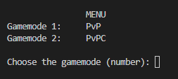 

>>### As the title says, we choose number one since it is the player vs player, after this we will be presented with the game board and we will be asked for the first move

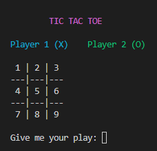 

>>### I'll make a move with each player

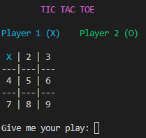 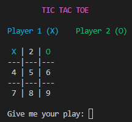

>>### This happens if player one or X wins

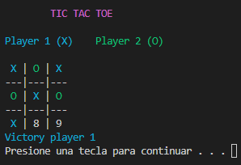 

>>### This happens if player two or O wins

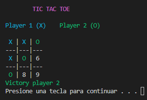 

>>### This happens if there is a tie between the players

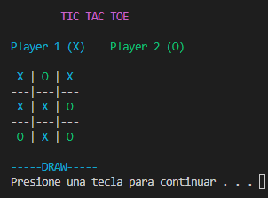 

>## **Player vs PC:**

>>### The first thing that is presented to us is the menu, we will also be asked to choose the game mode

 

>>### As the title says, we choose number two since it is the player vs PC, after this we will be presented with the game board and we will be asked for the first move

 

>>### I'll make a move and inmediatly the PC make his move

 

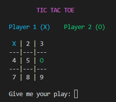

>>### This happens if player wins

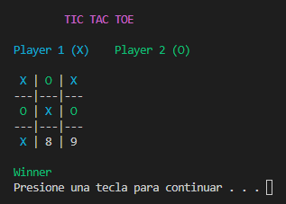 

>>### This happens if player PC wins

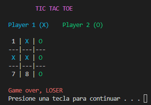 

>>### This happens if there is a tie 

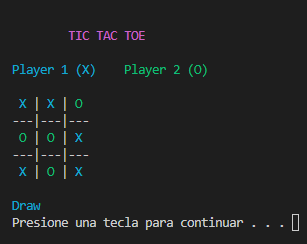 

>### [Return to index](#index)

># **CONCLUSIONS OF THE EXCERCISE**

<<### This project personally demanded a lot of my self-learning skills since most of the problems had to be solved by myself or thanks to the help of my colleagues, which for me was a huge advantage since "team" work helped me to solve many doubts, in a matter of complexity I feel that it was complex but nothing that some research and a lot of work could not achieve, it was a great experience of how to work in a good way and following specific conditions in addition to a great job to further develop my logic.

>### [Return to index](#index)

