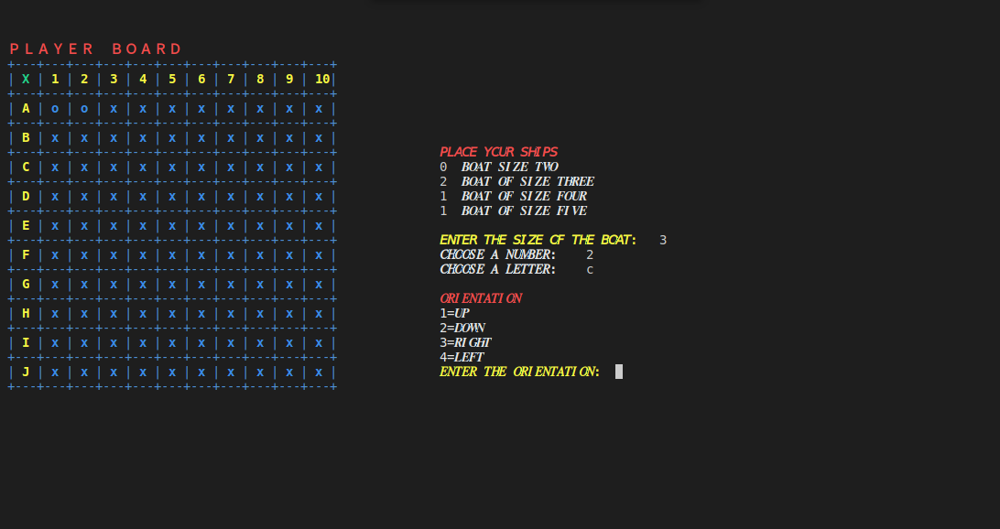
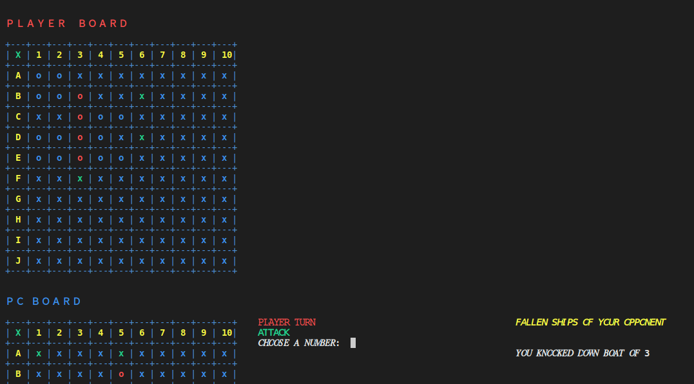
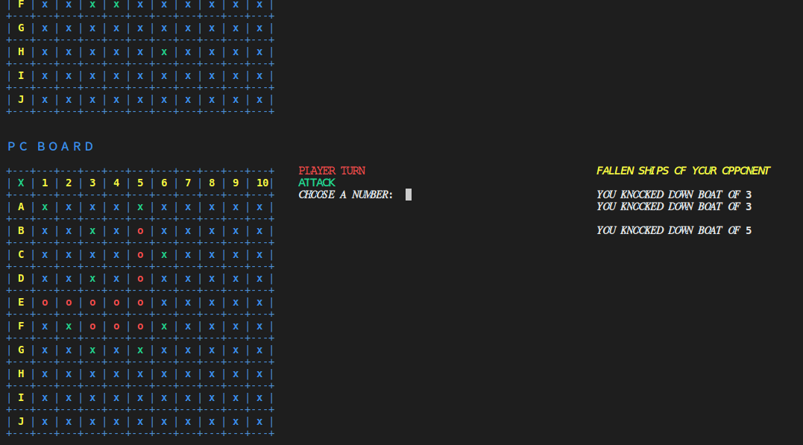
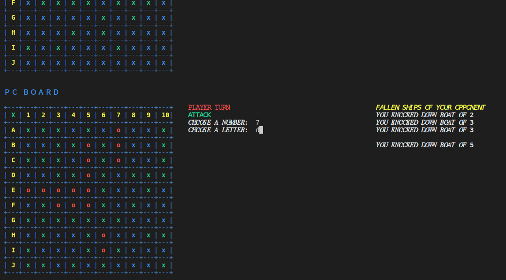
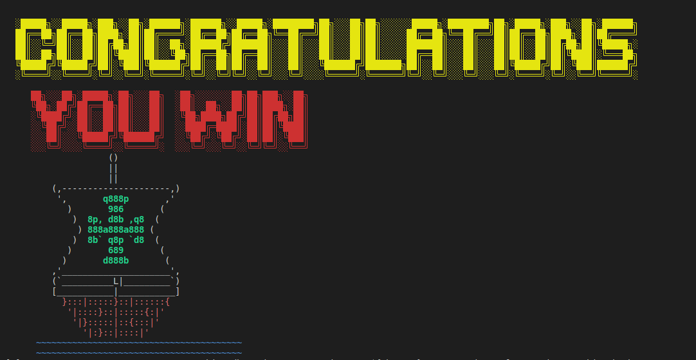
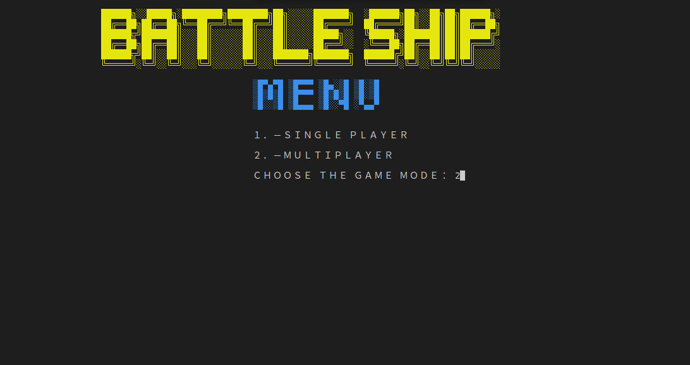
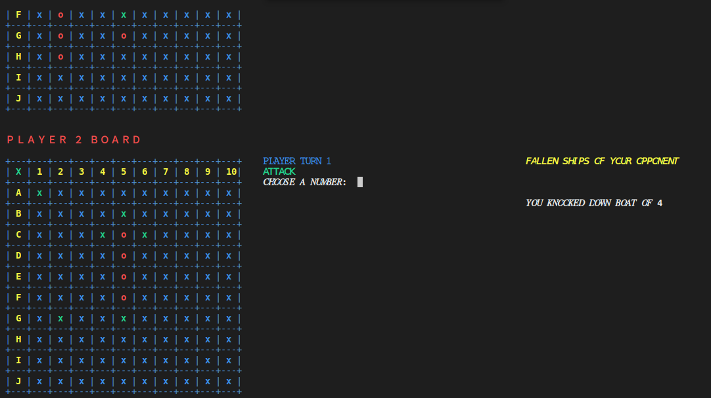
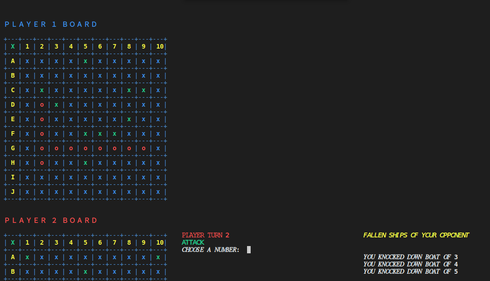
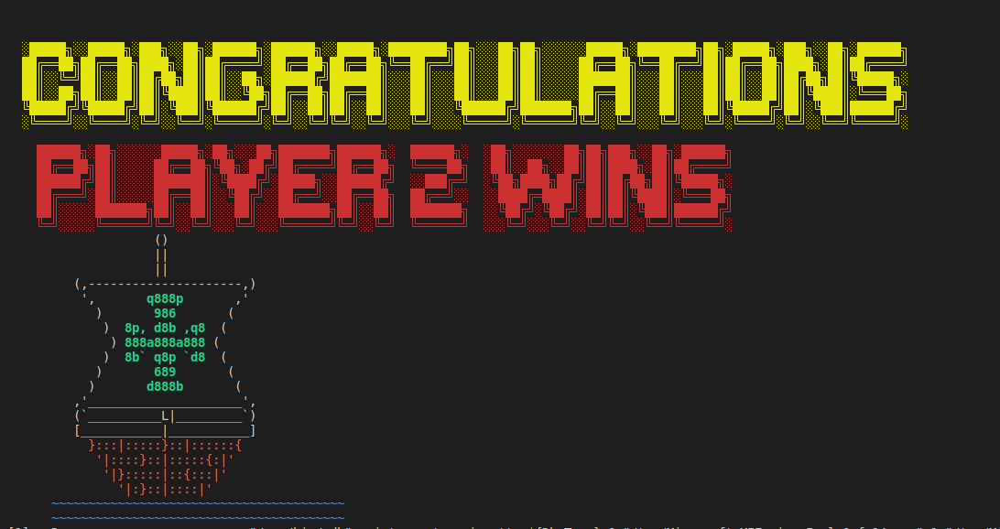

<h1 align="center">

 <h2 style="color:#49ABF3"> BATTLESHIP

 
</h1>

 
<h2 align="center">
</h2>

># **INDEX**
>## [A) Instructions for execution and use](#instruction-for-execution-and-use)
>## [B) FLOWCHART](#flowchart)
>## [B) Code execution and explanation](#code-execution-and-explanation)
>## [C) Conclusions of the exercise](#conclusions-of-the-excercise)

<h4 align="center">

># **INSTRUCTION FOR EXECUTION AND USE**</h4>

>## **General considerations:**
>### 1. The boards in multiplayer game mode are random and you don't know where are your ships
>### 2. In single player mode the computer always attack automatically
>### 3. The programm its a little bit slow when the boards are build but no too much
>## **Possible ERRORS**
>## 1. When the machine ask you for a letter to position, if you enter a number the programm crash

>## **HOW TO USE**
>>## **If you use Windows follow this steps**
>>### 1. Download the [executable](./01_BattleShip_Windows.exe)
>>### 2. Run the executable
>>### 3. Enjoy.
>>### IF THAT DOESN'T WORK TRY THIS
>>### 1. Install a git console to continue you can install one [here](http://git-scm.com/download/win) and choose the best option for you. 
>>### 2. Make a clone of my repository with this command in your git console:
>>>### git clone https://github.com/UP210553/UP210553_CPP.git
>>### 3. Enter the repository at the direction of the file with the command:
>>>### cd C:\Documents\...
>>### 4. To run the game type the next command:
>>>### 01_BattleShip_Windows.exe
>>### 5. ENJOY
>>## **If you use Linux follow this steps**

>>### 1. Download or clone my repo with the following command in the terminal:
   

>>>### "git clone https://github.com/UP210553/UP210553_CPP.git"

>>### 2. Install GNU c/c++ compiler, open the terminal and type:

>>>### $ sudo apt-get update
>>>### $ sudo apt-get install build-essential manpages-dev

>>### 3. To compile this program, type:

>>>### gcc 01_BattleShip_Linux.c -o 01_BattleShip_Linux

>>### 4. To run this program, type:
   

>>>### ./01_BattleShip_Linux

>### [Return to index](#index)

<h4 align="center">

># __FLOWCHART__</h4>

<h2 align="center">

</h2>

>### [Return to index](#index)

<h4 align="center">

># __CODE EXECUTION AND EXPLANATION__</h4>

># SINGLE PLAYER
>### 1. The menu and choose single player 
<h2 align="center">

</h2>

>### 2. You decide where do you like to put your ships
<h2 align="center">

</h2>

>### 3. The PC turn down a ship of us
<h2 align="center">

</h2>

>### 4. You turn down some ships of the PC
<h2 align="center">

</h2>

>### 5. You enter the last play 
<h2 align="center">

</h2>

>### 6. YOU WIN
<h2 align="center">

</h2>

>## MULTIPLAYER
>### 1. The menu and choose multiplayer mode
<h2 align="center">

</h2>

>### 2. Player 1 turn down one ship
<h2 align="center">

</h2>

>### 3. Player 2 turn down a lot of ships
<h2 align="center">

</h2>

>### 4. Player 2 wins
<h2 align="center">

</h2>

>### [Return to index](#index)

<h4 align="center">

># **CONCLUSIONS OF THE EXCERCISE**</h4>
>## To program the "Battle Ship" we put into practice all the knowledge obtained during the semester, we used functions, local variables, global variables, vectors and more. Doing this work was a very big challenge but it was not so complicated because we already had previous knowledge. It was a job very similar to the "Cat", however, it was more complex because the matrix is larger and each coordinate could obtain more than one value. The most complicated thing to do was to create artificial intelligence because it had to meet several conditions to be able to perform an attack, however, it was simpler than the artificial intelligence of the cat. 

>### [Return to index](#index)
